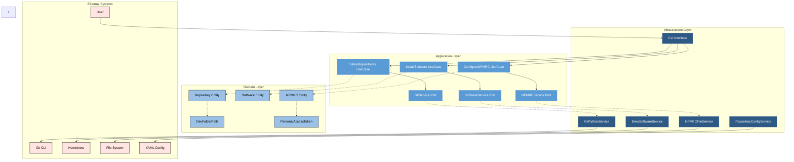

# Clean Architecture - Visual Representation

## Circular Architecture Diagram

```
                    CLEAN ARCHITECTURE
                    Setup Environment System

                     External Systems
                   ┌───────────────────────┐
                   │  User, Git, Homebrew  │
                   │   GitHub, FileSystem  │
                   └───────────┬───────────┘
                               │
               ┌───────────────▼───────────────┐
               │        INFRASTRUCTURE         │
               │                               │
               │  ┌─────────────────────────┐  │
               │  │      APPLICATION        │  │
               │  │                         │  │
               │  │  ┌─────────────────┐    │  │
               │  │  │     DOMAIN      │    │  │
               │  │  │                 │    │  │
               │  │  │  ┌───────────┐  │    │  │
               │  │  │  │ ENTITIES  │  │    │  │
               │  │  │  │           │  │    │  │
               │  │  │  │Repository │  │    │  │
               │  │  │  │Software   │  │    │  │
               │  │  │  │NPMRC      │  │    │  │
               │  │  │  └───────────┘  │    │  │
               │  │  │                 │    │  │
               │  │  │ Value Objects   │    │  │
               │  │  └─────────────────┘    │  │
               │  │                         │  │
               │  │    Use Cases            │  │
               │  │    Interfaces           │  │
               │  └─────────────────────────┘  │
               │                               │
               │    Services & Adapters        │
               └───────────────────────────────┘
```

## Layer Breakdown

### 🔵 Infrastructure Layer (Outermost - Dark Blue)
**Components:**
- CLI Interface (Primary Adapter)
- GitPythonService, BrewSoftwareService 
- NPMRCFileService, RepositoryConfigService
- PythonService, NVMService

**Responsibilities:**
- Framework-specific implementations
- External system integration
- I/O operations
- Concrete adapter implementations

### 🟠 Application Layer (Orange)
**Components:**
- SetupRepositories UseCase
- InstallSoftware UseCase  
- ConfigureNPMRC UseCase
- Service Interfaces (Ports)

**Responsibilities:**
- Business workflow orchestration
- Use case coordination
- Interface definitions
- Application-specific business rules

### 🟣 Domain Layer (Purple)
**Components:**
- Repository, Software, NPMRC Entities
- DevFolderPath, PersonalAccessToken Value Objects
- Domain Services

**Responsibilities:**
- Core business logic
- Business rules and validation
- Domain models
- Framework-independent code

### 🟪 Entities (Innermost - Dark Purple)
**Components:**
- Repository Entity
- Software Entity
- NPMRC Configuration Entity

**Responsibilities:**
- Core business objects
- Identity and lifecycle management
- Fundamental business rules
- Data integrity

## Dependency Flow

```css
External → Infrastructure → Application → Domain → Entities
    ↑                                                ↓
    └──────────────── Dependencies ─────────────────┘
                    (Point Inward Only)
```

## Key Principles

### 1. The Dependency Rule
- **Source code dependencies must point inward only**
- Outer layers can reference inner layers
- Inner layers cannot know about outer layers
- Business logic is protected from external changes

### 2. Port & Adapter Pattern
```css
Primary Adapters          Secondary Adapters
(Driving)                 (Driven)
     │                         │
     ▼                         ▼
┌─────────┐              ┌─────────┐
│   CLI   │              │   Git   │
│Interface│              │Service  │
└─────────┘              └─────────┘
     │                         ▲
     ▼                         │
┌─────────────────────────────────┐
│        Use Cases                │
│    (Application Core)           │
└─────────────────────────────────┘
```

### 3. Benefits
- ✅ **Framework Independence** - Business logic isolated
- ✅ **Testable** - Easy to mock external dependencies  
- ✅ **UI Independence** - Can swap CLI for web interface
- ✅ **Database Independence** - Can change storage systems
- ✅ **External Agency Independence** - External services can change

## Real-World Example Flow

```
1. User Command: setup-environment --dev-folder ~/dev
                           │
2. CLI Interface: Parse and validate input
                           │
3. SetupRepositories UseCase: Orchestrate workflow
                           │
4. Domain: Create Repository entities, validate paths
                           │
5. GitService Port: Abstract git operations
                           │
6. GitPythonService: Execute actual git commands
                           │
7. External Git CLI: Perform repository cloning
```

## Testing Strategy

```css
┌─────────────────┐    ┌─────────────────┐
│   Unit Tests    │    │Integration Tests│
│                 │    │                 │
│  Domain Layer   │    │  Full System    │
│  Use Cases      │    │  End-to-End     │
│(Fast, Isolated) │    │  (Slower)       │
└─────────────────┘    └─────────────────┘
         ▲                       ▲
         │                       │
┌─────────────────┐    ┌─────────────────┐
│   Mock Tests    │    │  Contract Tests │
│                 │    │                 │
│  Infrastructure │    │  Port/Adapter   │
│  Adapters       │    │  Interfaces     │
└─────────────────┘    └─────────────────┘
```



This architecture ensures your system is:
- **Maintainable**: Clear separation of concerns
- **Testable**: Each layer can be tested independently  
- **Flexible**: Easy to modify or extend functionality
- **Robust**: Changes in external systems don't break core business logic