# Clean Architecture - Visual Representation

## Circular Architecture Diagram

```css
                    CLEAN ARCHITECTURE
                    Setup Environment System

                     External Systems
                   ┌───────────────────────┐
                   │  User, Git, Homebrew  │
                   │   GitHub, FileSystem  │
                   └───────────┬───────────┘
                               │
               ┌───────────────▼───────────────┐
               │        INFRASTRUCTURE         │
               │                               │
               │  ┌─────────────────────────┐  │
               │  │      APPLICATION        │  │
               │  │                         │  │
               │  │  ┌─────────────────┐    │  │
               │  │  │     DOMAIN      │    │  │
               │  │  │                 │    │  │
               │  │  │  ┌───────────┐  │    │  │
               │  │  │  │ ENTITIES  │  │    │  │
               │  │  │  │           │  │    │  │
               │  │  │  │Repository │  │    │  │
               │  │  │  │Software   │  │    │  │
               │  │  │  │NPMRC      │  │    │  │
               │  │  │  └───────────┘  │    │  │
               │  │  │                 │    │  │
               │  │  │ Value Objects   │    │  │
               │  │  └─────────────────┘    │  │
               │  │                         │  │
               │  │    Use Cases            │  │
               │  │    Interfaces           │  │
               │  └─────────────────────────┘  │
               │                               │
               │    Services & Adapters        │
               └───────────────────────────────┘
```



```mermaid
%%{init: {'theme':'base', 'themeVariables': { 'primaryColor': '#f9f9f9', 'primaryTextColor': '#000', 'primaryBorderColor': '#333', 'lineColor': '#666', 'fontSize': '14px'}}}%%

graph LR
    %% External Systems (outermost ring)
    User([👤 User])
    Git([🔧 Git CLI])
    Homebrew([🍺 Homebrew])
    Files([📁 File System])
    GitHub([🐙 GitHub])
    
    %% Infrastructure Layer (outer ring)
    CLI[CLI Interface]
    GitSvc[GitPythonService]
    BrewSvc[BrewSoftwareService]
    NPMSvc[NPMRCFileService]
    ConfigSvc[YamlRepositoryConfigService]
    
    %% Application Layer (middle ring)
    SetupUC[SetupRepositories]
    InstallUC[InstallSoftware]
    NPMrcUC[ConfigureNPMRC]
    GitPort[GitService Port]
    SwPort[SoftwareService Port]
    NPMPort[NPMRCService Port]
    
    %% Domain Layer (inner ring)
    RepoEntity[Repository Entity]
    SwEntity[Software Entity]
    NPMEntity[NPMRC Entity]
    PathVO[DevFolderPath]
    TokenVO[PersonalAccessToken]
    
    %% Connections - Dependencies flow inward
    User --> CLI
    CLI --> SetupUC
    CLI --> InstallUC
    CLI --> NPMrcUC
    
    SetupUC --> GitPort
    InstallUC --> SwPort
    NPMrcUC --> NPMPort
    
    GitPort -.-> GitSvc
    SwPort -.-> BrewSvc
    NPMPort -.-> NPMSvc
    
    GitSvc --> Git
    BrewSvc --> Homebrew
    NPMSvc --> Files
    ConfigSvc --> Files
    
    SetupUC -.-> RepoEntity
    InstallUC -.-> SwEntity
    NPMrcUC -.-> NPMEntity
    
    RepoEntity -.-> PathVO
    NPMEntity -.-> TokenVO
    
    %% Styling for circular appearance
    classDef external fill:#50C878,stroke:#fff,stroke-width:3px,color:#000
    classDef infrastructure fill:#4A90E2,stroke:#fff,stroke-width:3px,color:#fff
    classDef application fill:#F5A623,stroke:#fff,stroke-width:3px,color:#000
    classDef domain fill:#7B68EE,stroke:#fff,stroke-width:3px,color:#fff
    classDef entity fill:#9B59B6,stroke:#fff,stroke-width:2px,color:#fff
    
    class User,Git,Homebrew,Files,GitHub external
    class CLI,GitSvc,BrewSvc,NPMSvc,ConfigSvc infrastructure
    class SetupUC,InstallUC,NPMrcUC,GitPort,SwPort,NPMPort application
    class RepoEntity,SwEntity,NPMEntity domain
    class PathVO,TokenVO entity
```

## Layer Breakdown

### 🔵 Infrastructure Layer (Outermost - Dark Blue)
**Components:**
- CLI Interface (Primary Adapter)
- GitPythonService, BrewSoftwareService 
- NPMRCFileService, YamlRepositoryConfigService
- BrewPythonService, NodeEnvironmentService

**Responsibilities:**
- Framework-specific implementations
- External system integration
- I/O operations
- Concrete adapter implementations

### 🟠 Application Layer (Orange)
**Components:**
- SetupRepositories UseCase
- InstallSoftware UseCase  
- ConfigureNPMRC UseCase
- Service Interfaces (Ports)

**Responsibilities:**
- Business workflow orchestration
- Use case coordination
- Interface definitions
- Application-specific business rules

### 🟣 Domain Layer (Purple)
**Components:**
- Repository, Software, NPMRC Entities
- DevFolderPath, PersonalAccessToken Value Objects
- Domain Services

**Responsibilities:**
- Core business logic
- Business rules and validation
- Domain models
- Framework-independent code

### 🟪 Entities (Innermost - Dark Purple)
**Components:**
- Repository Entity
- Software Entity
- NPMRC Configuration Entity

**Responsibilities:**
- Core business objects
- Identity and lifecycle management
- Fundamental business rules
- Data integrity

## Dependency Flow

```css
External → Infrastructure → Application → Domain → Entities
    ↑                                                ↓
    └──────────────── Dependencies ─────────────────┘
                    (Point Inward Only)
```

## Key Principles

### 1. The Dependency Rule
- **Source code dependencies must point inward only**
- Outer layers can reference inner layers
- Inner layers cannot know about outer layers
- Business logic is protected from external changes

### 2. Port & Adapter Pattern
```css
Primary Adapters          Secondary Adapters
(Driving)                 (Driven)
     │                         │
     ▼                         ▼
┌─────────┐              ┌─────────┐
│   CLI   │              │   Git   │
│Interface│              │Service  │
└─────────┘              └─────────┘
     │                         ▲
     ▼                         │
┌─────────────────────────────────┐
│        Use Cases                │
│    (Application Core)           │
└─────────────────────────────────┘
```

### 3. Benefits
- ✅ **Framework Independence** - Business logic isolated
- ✅ **Testable** - Easy to mock external dependencies  
- ✅ **UI Independence** - Can swap CLI for web interface
- ✅ **Database Independence** - Can change storage systems
- ✅ **External Agency Independence** - External services can change

## Real-World Example Flow

```css
1. User Command: setup-environment --dev-folder ~/dev
                           │
2. CLI Interface: Parse and validate input
                           │
3. SetupRepositories UseCase: Orchestrate workflow
                           │
4. Domain: Create Repository entities, validate paths
                           │
5. GitService Port: Abstract git operations
                           │
6. GitPythonService: Execute actual git commands
                           │
7. External Git CLI: Perform repository cloning
```

## Testing Strategy

```css
┌─────────────────┐    ┌─────────────────┐
│   Unit Tests    │    │Integration Tests│
│                 │    │                 │
│  Domain Layer   │    │  Full System    │
│  Use Cases      │    │  End-to-End     │
│(Fast, Isolated) │    │  (Slower)       │
└─────────────────┘    └─────────────────┘
         ▲                       ▲
         │                       │
┌─────────────────┐    ┌─────────────────┐
│   Mock Tests    │    │  Contract Tests │
│                 │    │                 │
│  Infrastructure │    │  Port/Adapter   │
│  Adapters       │    │  Interfaces     │
└─────────────────┘    └─────────────────┘
```

This architecture ensures your system is:
- **Maintainable**: Clear separation of concerns
- **Testable**: Each layer can be tested independently  
- **Flexible**: Easy to modify or extend functionality
- **Robust**: Changes in external systems don't break core business logic